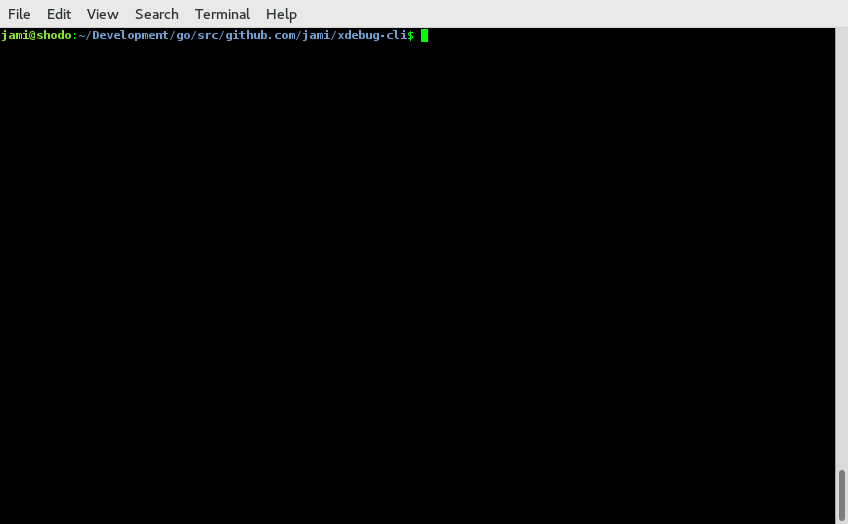

# XDebug CLI

## What?

XDebug-cli or xdbg is a cli xdebug client. The debugging flow is gdb oriented.

## UseCase

You can use xdebug-cli like any other PHP debugger. You specify a host and a port where xdebug dbgp can connect to. If then a PHP script is executed a xdebug-cli debug session is created and you can interact via CLI.

## Demo

## Build

Build xdebug-cli local

    make build/local

Build xdebug-cli release

    make build/release

Build docker example

    make build/docker

## Testing

Test all suites

    make test

## Help

Show some helpful informations

    xdbg help

## Modes

### Mode listen

The listening mode is the most common case. xdebug-cli creates a server socket and waits for incomming xdebug dbgp sessions. Default host is 127.0.0.1 and default port is 9000

    xdbg listen

### Mode run

The run mode is a more compact form which is dedicated to run PHP CLI scripts with a attached debug session.

    xdbg run -h 127.0.0.1 -p 9000 -- php ./app/mycli.php --some="longopts" -f -l -a -g -s

## Session commands

### run

Run the application until the next breakpoint.

### break

You can set breakpoints on files

    // break on myfile.php in line 100
    (xgdb) break myfile.php:100
    // break on the current file in line 100
    (xgdb) break :100

Conditionals can be added to the breakpoint definition

    // e.g. for ($i = 0; $i < 100; $i++) {}
    // break on myfile.php in line 100 if $i equals 10
    (xgdb) break myfile.php:100 $i==10

### step

Step into the next instruction

    (xgdb) step

### next

Step over the next instruction

    (xgdb) next

### print

Prints information about a variable

    (xgdb) print $_SERVER

### context

Print properties in a given context at a given stack depth

* local
* global
* constant

    (xgdb) context local

### finish

Close the current debug session

    (xgdb) finish

### info

Shows several debug session informations

#### breakpoints

Show a list with all breakpoints that are set

    (xgdb) info breakpoints

## Example

Listening mode

    xdbg listen -h 127.0.0.1 -p 9000

Run mode

    xdbg run -- php _examples/test.php
  
Hot pluging xdebug lib and some options

    php -d zend_extension=xdebug.so -d xdebug.remote_host=127.0.0.1 -d xdebug.remote_port=9000 test.php

Build and run

    make && ./bin/xdbg run -- php _example/test.php
